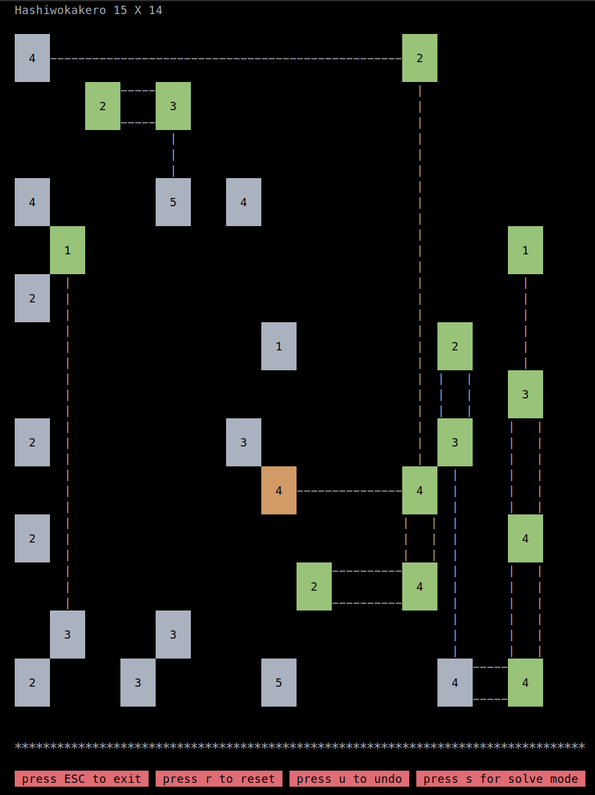

# hashi
A simple terminal graphics implementation of the game Hashiwokakero ([橋をかけろ](https://de.wikipedia.org/wiki/Hashiwokakero)), implemented as a project for the course "Programming in C++ SS2018" at the university of Freiburg.



## Compile
```bash
$ git clone https://github.com/twinter42/hashi.git
$ cd hashi
$ make all
```

## Run
The program takes on of the game files (found in `instances`) as an argument:
```bash
$ ./HashiMain instances/i031-n007-s07x07.xy
```
